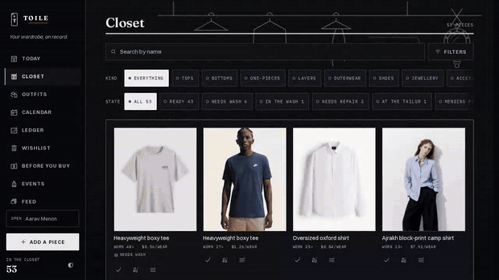

# ALMARI

> *almari /ʌlˈmɑːri/ — n.* A wardrobe; the cupboard a household's clothes live in.
> From Portuguese *armário*, by way of Hindi and half the languages of the
> subcontinent — the ordinary word for the ordinary piece of furniture.

**Your wardrobe, on record.** A private ledger for a real wardrobe — track what you
own, what you actually wear, and what it costs per wear. No account, no cloud, no
subscription, no shop links. Everything lives on your device.

**Live:** https://occult-kranti.github.io/wardrobe-tracker/ · **V2 (glass):** https://occult-kranti.github.io/wardrobe-tracker/v2/ · **Mobile design pack:** https://occult-kranti.github.io/wardrobe-tracker/mobile_version_v1/

**The company:** [the plan, published in the open](https://occult-kranti.github.io/wardrobe-tracker/company/) · [the workroom](https://occult-kranti.github.io/wardrobe-tracker/company/tracker.html) — the launch plan as assignable work. Written up in full at [`docs/28-the-company.md`](docs/28-the-company.md).

---

## See it move



*The film, shot on the V2 glass build:*
*[**demo.mp4**](https://occult-kranti.github.io/wardrobe-tracker/demo.mp4) (96s, 1080p) — a wardrobe begun empty, the two-tap log, three sample closets, the ledger, the cooling-off, the honest calendar, and the rooms.*
*[**demo-vertical.mp4**](https://occult-kranti.github.io/wardrobe-tracker/demo-vertical.mp4) (54s, 9:16) — the same argument cut for a phone.*

---

## Why this exists

The wardrobe-app category has a trust problem. Apps ask users to spend eight hours
photographing their closets, then paywall the analytics that made the labor worth it
(Indyx, $74.99/yr; Cladwell, $95.88/yr) — or cap the free closet at exactly 100 items
(Acloset, GetWardrobe), or charge for backup. The ones that stay free stay free
because they earn when you buy: Whering's lead investor is eBay, and Alta holds
4,000 brand partnerships. Meanwhile fashion apps average about 28% retention at
90 days, because logging a wear takes longer than the habit can survive.
[The full benchmark of eleven apps](docs/24-competitive-benchmark.md) has the numbers.

Almari takes the opposite bet: give away everything the others charge for
(cost-per-wear, utilization, the full ledger), keep the daily loop under two taps,
and never make the record hostage. There is no server to hold it.

## What it does

- **Closet** — catalogue pieces with photos (or without: every category has a drawn
  flat, so photo-free use looks intentional). Brand, source, and a free-text
  *fits like* line; no size schema, no measurements.
- **Today** — the day's single question, answered in two taps. Wear logging credits
  every piece in an outfit and never shames a missed day.
- **Outfits** — build layered outfits with any number of pieces from any category.
  The generator only deals wearable cards: clean, unbenched, unretired.
- **Calendar** — a week view where future days are *plans* (they don't inflate wear
  counts) and past days are never a report card.
- **Ledger** — utilization, cost-per-wear, monthly activity, a plain brand table,
  and *"14 pieces haven't had a first wear yet. $890 is resting here."* Stated once,
  like a bank balance. Resting, never wasted.
- **Before you buy** — tempted by something? Pick a colour and a couple of tags and
  see the pieces you *already own* that are close, with their wear counts and
  cost-per-wear. It shows you the facts and then stops talking. Two equally weighted
  exits, no verdict, and never a shop link.
- **Wishlist** — optional cooling-off wait (default 7 days) that stays completely
  silent, then asks once: Keep / Let it go / Bought. Released items collect in a
  quiet ledger: *"$1,340 stayed yours."*
- **Mending** — `needs repair` and `at the tailor` are bench states; a torn shirt is
  neither clean nor dirty. Empty pile reads *"Your needle rests."*
- **Retire, don't delete** — a piece can leave the closet with its full history kept.
- **Lift a garment off its background** — the category's headline feature, done in
  your browser. No model download, no upload, no company touching the photograph.
  Two pictures and one slider: take the cut or keep the original, both finished
  states. (Whering's own reviewers put its server-side cutout at "about 50% of
  the time"; its Play Store disclosure says it shares photos with third parties.)
- **What's it like out?** — one tap, four answers, kept for the day. It narrows
  the day's suggestions the way weather-aware rivals do, without a location
  permission, a forecast API, or anything to leak.
- **On your home screen** — a manifest and an offline service worker, so Almari
  gets an icon, opens full screen, and works with no signal. No store, no account.
- **Catalogue from photos** — the first hour is the slowest thing about a wardrobe app,
  so hand a photograph of the clothes to whatever vision model you already use, with
  [the prompt](docs/23-photo-intake.md), and drop the file it writes into the app. Every
  piece arrives as a draft with its doubts stated; nothing is written until you say so.
  The photograph never passes through us — there is nothing here to pass through.

## Design

The identity, developed under the working name *Toile*, is pattern-cutting paper, iron-gall ink, and one sealing-wax
carmine used scarcely. Icons are technical fashion flats — garments drawn the way a
pattern-drafter draws them, with real construction and **no bodies**, so nothing
assumes who wears what. Every mark is hand-coded SVG; there are no raster assets.

It was designed against a documented contract rather than taste alone:

| Document | What's in it |
|---|---|
| [`docs/05-brand-identity.md`](docs/05-brand-identity.md) | The binding design contract — palette (AA-verified, light + dark), typography, icon grammar, art direction, component law |
| [`docs/06-focus-group-requirements.md`](docs/06-focus-group-requirements.md) | Feature requirements and copy law from the focus group |
| [`docs/01-market-research.md`](docs/01-market-research.md) | Competitive analysis |
| [`docs/24-competitive-benchmark.md`](docs/24-competitive-benchmark.md) | Sourced benchmark of eleven wardrobe apps — pricing, users, reviews, data practices |
| [`docs/02-design-psychology.md`](docs/02-design-psychology.md) | Color and interaction psychology |
| [`skills/wardrobe-brand/SKILL.md`](skills/wardrobe-brand/SKILL.md) | The operational digest — load before any UI change |

Three brand concepts were developed independently and scored by a
consumer-psychologist, a principal designer, and a staff engineer; Toile won two of
three verdicts, and the runners-up's best ideas were grafted in. Requirements were
then set by a focus group of LGBTQ+ fashion designers and shopaholic archetypes,
moderated, and reviewed by a developer and a behavioral psychologist.

**What the panel vetoed, and we honored:** no gender question or gendered sections
ever · no commerce anywhere near the anti-impulse features · no shame mechanics,
guilt screens, or red alarm colors on low-wear pieces · no badges, streaks, or
confetti · no notifications · no accounts, cloud sync, or telemetry · no required
fields that erase people (required brand erases makers, required photos erase the
privacy-conscious, fixed categories erase everyone else).

## Privacy

All data is stored locally in your browser. Nothing is sent anywhere — there is no
server, no analytics, and no account. Export a complete, lossless JSON backup from
Settings at any time; imports round-trip every field, including ones added by later
versions. Because the record lives only on this device, the app will quietly remind
you to keep a backup.

## Development

```bash
npm install
npm run dev      # vite dev server
npm run build    # typecheck + production build
npm run lint     # oxlint + the brand contract
npm run verify   # build, brand, migration, persona and intake suites

# The browser suites. Serve a build first: npx vite preview --port 4174
npm run test:flows     # every route, signed out and in, phone and desktop
npm run test:features  # the door, the cutout, the weather, installability
```

Stack: React 19 · TypeScript · Vite · Tailwind CSS v4 · React Router (HashRouter,
for static hosting) · localStorage.

---

*Built as an argument that a free tool can be the most trustworthy one in its category.*
