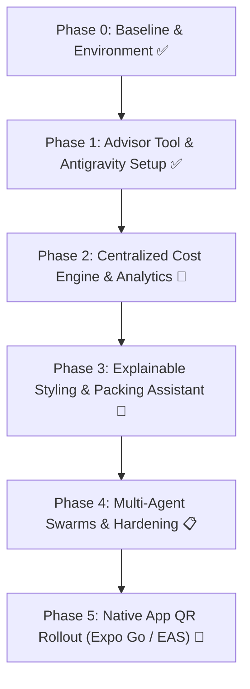

# 44 — Alpha Website Competitive Roadmap & Strategic Positioning

> **Status:** Active · **Ref:** `AI_Stylist_Digital_Wardrobe_Competitive_Framework_v1.0.xlsx` · **Date:** 2026-08-28
> **Mission:** Operationalize insights from the comprehensive competitive intelligence audit (~382 capabilities across 9 direct competitors, 11 adjacent platforms, and emerging architectures) to deliver an unassailable Alpha launch for Almari.

---

## 1. Competitive Intelligence & Market Map Synthesis

Analysis of the 382-capability competitive matrix and JTBD divergence reveals three foundational structural dynamics in the digital wardrobe space:

### A. The Two Divergent Customer Archetypes
1. **The Organizers** (*Stylebook, Indyx*): View cataloguing and meticulous bookkeeping as the reward itself. They require rich metadata, lossless exports, and deep analytics (cost-per-wear, purchase history, source/maker tracking).
2. **The Deciders** (*Acloset, Alta, Pronti*): Resent tedious data entry and seek instant, high-confidence outfit decisions on busy weekday mornings.

> **Almari's Strategic Positioning:** Almari satisfies the **Organizer** through a privacy-first, lossless ledger with zero brand erasure, while simultaneously serving the **Decider** through AI intake (Claude Fable + Kimi relay), deterministic persona inspiration, and sub-second outfit generation.

### B. The Anti-Shame Counter-Positioning Moat
Nearly all incumbent apps monetize via aggressive freemium gating, affiliate commerce drift, and guilt mechanics ("you only wore this once!").
- **Almari's Non-Negotiables** (Local-First, No Commerce, Zero Shame, Positive-Only Honors) represent a radical, durable counter-positioning advantage.
- The Ledger frames low wear neutrally as *"quiet lately"*, providing thoughtful re-wear pathways rather than scolding.

### C. The Real AI Frontier: Explainability vs. Commoditization
- Computer vision auto-tagging and basic background removal have commoditized to near-zero build cost.
- Incumbent "AI styling" is widely criticized in user reviews as feeling like a *clumsy randomizer*.
- **Almari's Differentiator:** Transparent, explainable styling rationale (identifying silhouette balance, color harmony, and occasion appropriateness) combined with privacy-preserving, local-first execution.

---

## 2. Table Stakes vs. Differentiators vs. Frontier

| Horizon | Capabilities | Almari Status & Implementation |
|---|---|---|
| **Table Stakes** | Bulk photo upload, automatic background removal, category/color tagging, manual override, outfit builder, calendar logging, cost-per-wear | ✅ Shipped in web PWA; all verification gates green. |
| **Differentiators** | Centralized CPW accounting with repair logs `(cost + Σ repairs) / wears`, falling CPW trajectory over time, re-wear rate metric (`wears ÷ distinct pieces`), neutral/non-shame framing, lossless JSON migration, maker/tailor respect | 🚀 Shipped in Phase 2 / Website Alpha. |
| **Emerging Frontier** | Explainable AI styling, packing list generator, sealed seasonal recap cards, local-first E2E sync, culturally-native taxonomies | 📋 Phase 3 & 4 Roadmap. |

---

## 3. The Alpha Launch Roadmap & Subgoals

### Phase 1: Advisor Tool & Antigravity Customizations (✅ Shipped)
- [x] Prepend Claude Advisor timing guidance to agent system prompts.
- [x] Configure workspace rules (`GEMINI.md`, `AGENTS.md`) and `.agents/skills/`.
- [x] Establish Kimi multimodal research engine skill and subagent swarm laws.

### Phase 2: Centralized Cost Engine & Ledger Upgrade (🚀 Shipped)
- [x] Centralize `calculateCostPerWear` helper in `@almari/shared/cost.ts` incorporating repair logs `(cost + Σ repairs) / wears`.
- [x] Add Re-Wear Rate (`wears / distinct pieces worn`) to the Ledger (`src/pages/Statistics.tsx`).
- [x] Add Cost-Per-Wear trajectory / value realized trends.
- [x] Add Factual Seasonal & Occasion coverage gap analysis.
- [x] Automated test suite `scripts/test-cost-engine.mjs` wired into `npm run verify`.

### Phase 3: Explainable AI Styling & Packing Module (🚀 Shipped)
- [x] Refine `src/lib/similarity.ts` with transparent recommendation reasons.
- [x] Add Packing List Generator modal (`src/components/PackingListModal.tsx`) in Closet view.
- [x] Maintain zero regression on brand contract and mobile viewport safety (390px).

### Phase 4: Swarm Orchestration & Alpha Polish (📋 Active)
- [ ] Parallelize testing across disjoint squads: `SHARED-CORE`, `UI-LEAD`, `QA-SENTINEL`.
- [ ] Complete owner fills in `docs/37-alpha-kit.md`.
- [ ] Final advisor sign-off pass before alpha tag.

### Phase 5: Mobile Distribution (📱 Next)
- [ ] Expo Go QR distribution for initial 15–50 testers (no App Store / Play Store blocker).
- [ ] EAS Update for instant over-the-air iteration.

